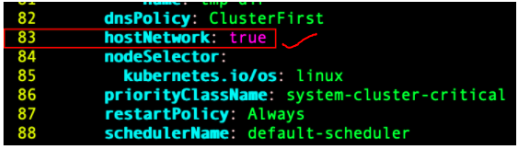

# k8s
<h3>It started working after edited the metrics-server deployment yaml config to include a DNS policy.</h3>
  ~$ kubectl apply -f metrics-server-components.yaml 
  ~$ kubectl edit deployments.apps -n kube-system metrics-server 
 Add this below dns policy or at the end of the container section above the restart policy. 
 hostNetwork: true 

